# AfriTalent
Projet fil rouge — Plateforme de mise en relation entre freelances africains et
clients.
Auteur : Mariata Ba
Promotion : L1 Web — ISI
---


## 🚀 Fonctionnalités

### Navigation
- Navbar fixe responsive (Bootstrap 5) avec menu hamburger sur mobile
- Effet de scroll : la navbar change d'apparence après 50px de défilement
- Bouton **"Retour en haut"** qui apparaît au scroll
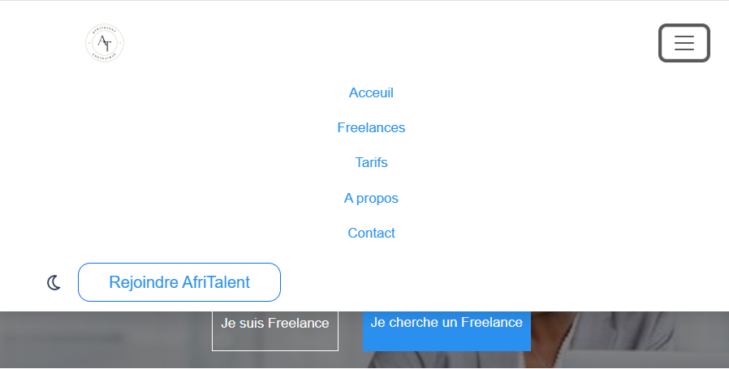
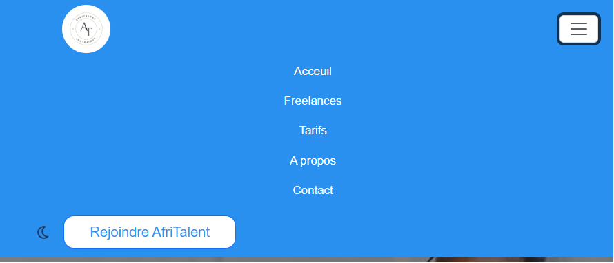
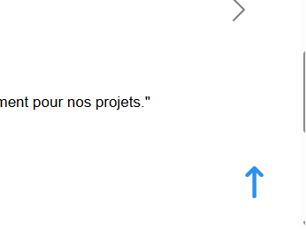

### Mode sombre
- Toggle dark mode persistant grâce à `localStorage`
- Icône lune/soleil selon le thème actif
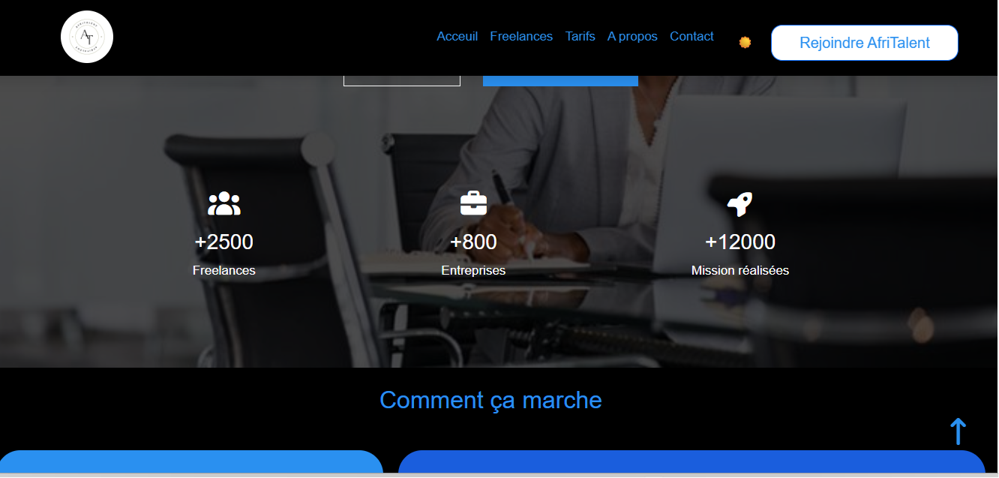

### Page Accueil (`index.html`)
- Section hero avec compteurs animés (Freelances, Entreprises, Missions)
- Section "Comment ça marche" en grille bento (4 étapes)
- Catégories de services avec compteurs animés
- Carousel de témoignages (Bootstrap)
- Section CTA (Call to Action)
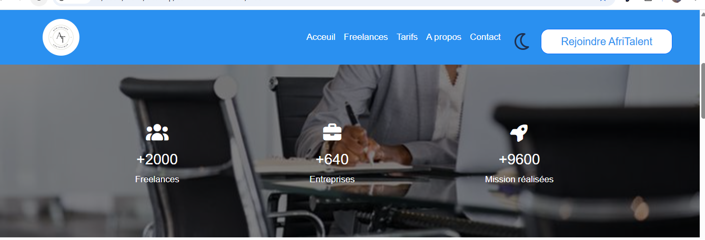


### Page Freelances (`freelances.html`)
- Grille de 9 profils freelances
- Système de **filtrage par catégorie** (boutons actifs : Tous, Développement, Design UI/UX, Marketing Digital, etc.)
- Affichage/masquage dynamique des cartes selon le filtre sélectionné


### Page Tarifs (`tarifs.html`)
- 3 plans tarifaires : Gratuit / Pro / Entreprises
- Badge "Populaire" sur le plan Pro
- **FAQ accordéon** (Bootstrap) avec 5 questions fréquentes
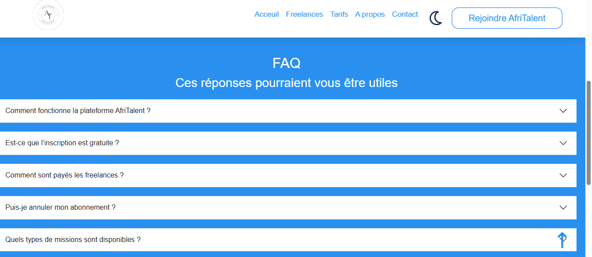

### Page À propos (`about.html`)
- Section histoire de la plateforme
- Présentation de l'équipe (4 membres avec liens sociaux)
- Section valeurs (Innovation, Accessibilité, Communauté, Excellence)
- **Chiffres clés** avec grille bento et compteurs animés au scroll (15 000 talents, 25 000 projets, 600 collaborateurs, 20 pays, 6 implantations)
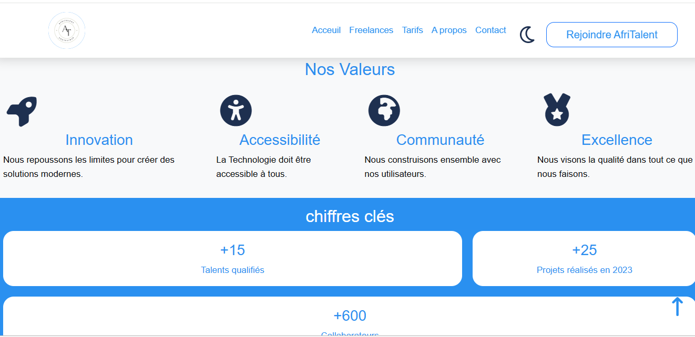

### Page Contact (`contact.html`)
- Formulaire avec **validation JavaScript** côté client (prénom, nom, email, adresse, sujet, message)
- Validation regex pour le format email
- Message de succès affiché 5 secondes après envoi
- Coordonnées de l'entreprise
- **Carte Google Maps** intégrée (Saint-Louis, Sénégal)
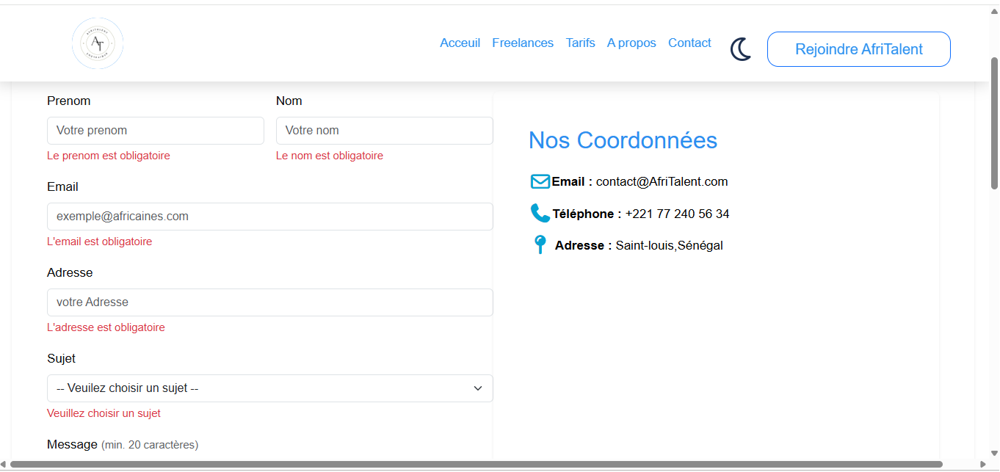
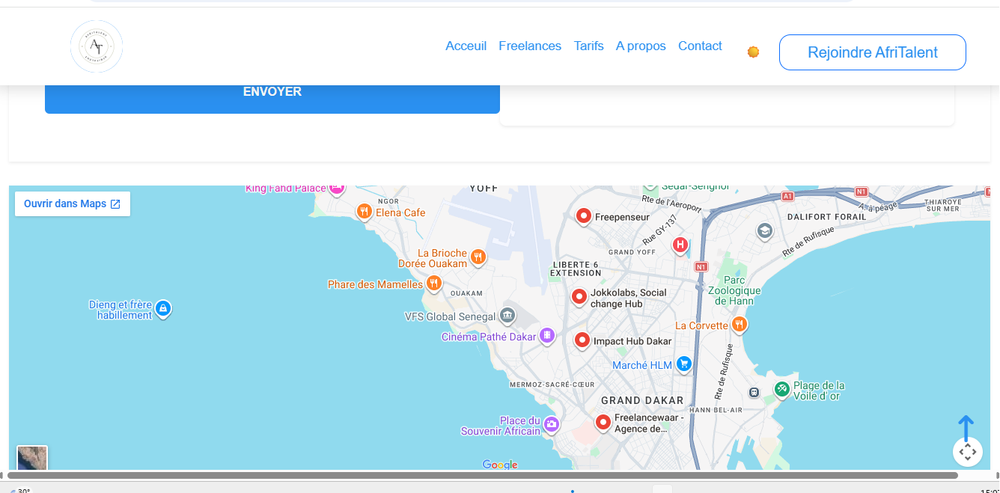

### Animations
- **Fade-in** au scroll via `IntersectionObserver` (`.fade-in` → `.visible`)
- **Compteurs animés** déclenchés à l'entrée dans le viewport (`IntersectionObserver`)

---
## Arborescence :
C:.
│   .gitignore
│   about.html
│   contact.html
│   freelances.html
│   index.html
│   README.md
│   tarifs.html
│
├───css
│       style1.css
│
├───docs
│       Ba_Mariata_Presentation.pptx
│
├───images
│       1.jpeg
│       10.jpeg
│       11.jpeg
│       12.jpeg
│       13.jpeg
│       14.jpeg
│       15.jpeg
│       16.jpeg
│       17.jpeg
│       18.jpeg
│       19.jpeg
│       2.jpeg
│       3.jpeg
│       4.jpeg
│       5.jpeg
│       50.jpeg
│       6.jpeg
│       60.jpeg
│       7.jpeg
│       70.jpeg
│       8.jpeg
│       80.jpeg
│       9.jpeg
│       apropos.png
│       btninscription.png
│       carousel.png
│       categories.png
│       cmmtçamrche.png
│       compteuranimes.png
│       contact1.png
│       contact2.png
│       DarkmodeApropros.png
│       DarkmodeContact.png
│       DarkmodeFreelance.png
│       DarkmodeIndex.png
│       DarkmodeTarif.png
│       equipe.png
│       FAQ.png
│       freelance.png
│       iframe.png
│       menuhamburger.png
│       menuScroll.png
│       moon-regular.png
│       pagedacceuil.png
│       retourenhaut.png
│       Tarif.png
│       valeurs.png
│
└───js
        main.js

## 🖼️ Aperçu du site

### Page Accueil


### Page Freelances
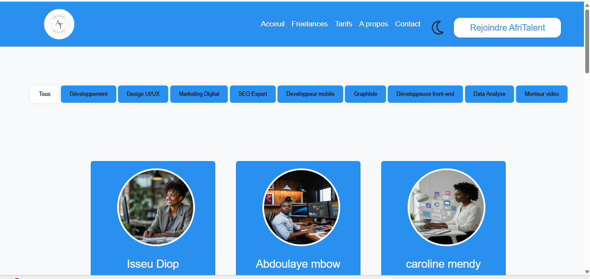

### Page Tarifs
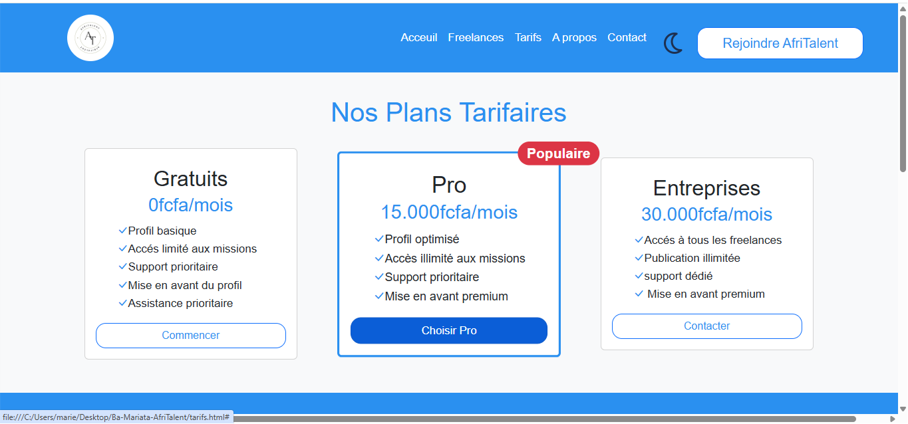

### Page À propos
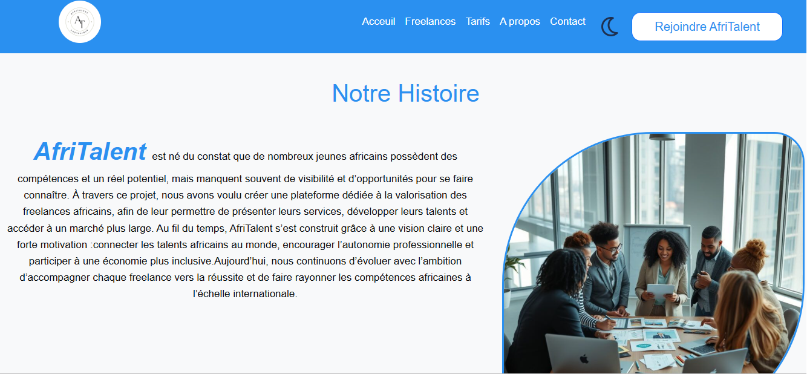

### Page Contact
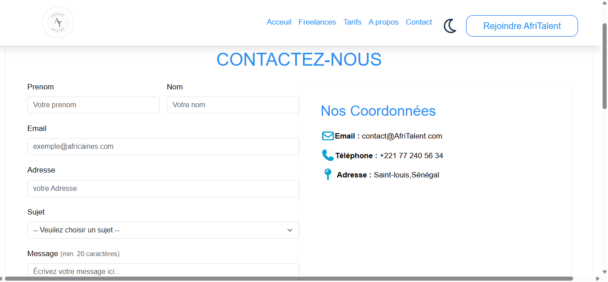
---

## 🛠️ Technologies utilisées

| Technologie | Version | Usage |
|---|---|---|
| HTML5 | — | Structure des pages |
| CSS3 | — | Styles personnalisés |
| JavaScript (ES6+) | — | Interactivité, animations, validation |
| Bootstrap | 5.3.0 | Grille responsive, navbar, carousel, accordion |
| Bootstrap Icons | 1.11.3 | Icônes (page tarifs) |
| Font Awesome | 7.0.1 | Icônes générales |
| Google Fonts | — | Police Open Sans |

---

## 📦 Installation

Aucune installation requise. Le projet est entièrement statique.

1. Cloner ou télécharger le projet
2. Ouvrir `index.html` dans un navigateur
3. Toutes les dépendances sont chargées via CDN

```bash
git clone https://github.com/mariata221/Ba-Mariata-AfriTalent.git
cd afritalent
# Ouvrir index.html dans votre navigateur